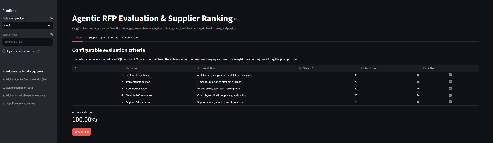
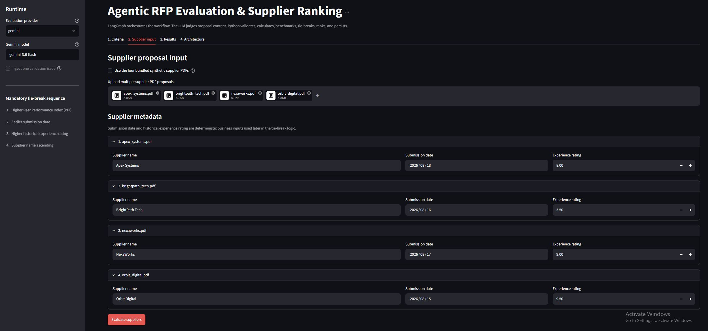
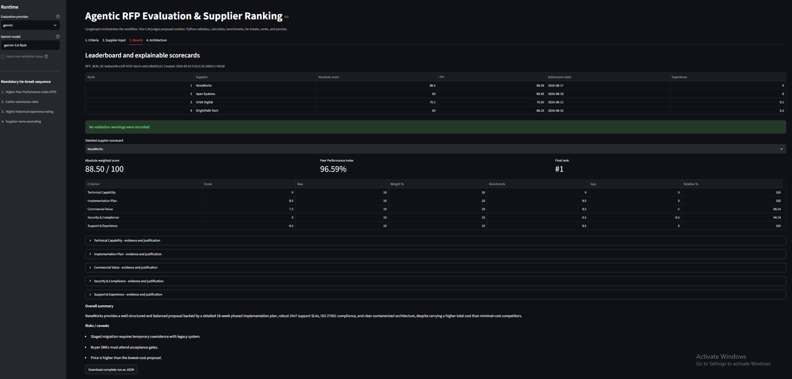
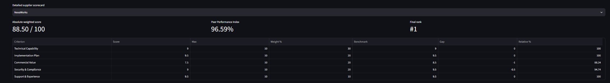
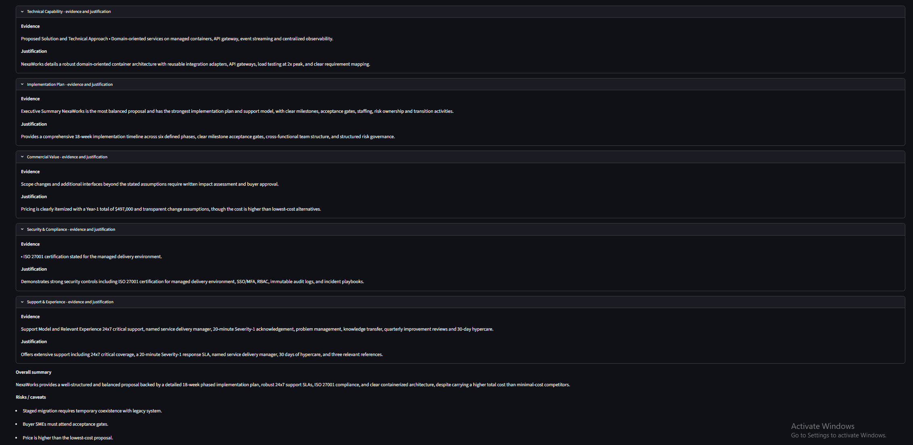

# Agentic RFP Evaluation - Two-Python-File Version

This project uses only **two Python source files**:

```text
app.py       -> Streamlit user interface
workflow.py  -> LangGraph + LLM + PDF + validation + scoring + SQLite
```

The rest of the repository contains submission artifacts rather than application modules: `requirements.txt`, the SQLite schema/seed SQL, four synthetic PDFs, documentation, and sample JSON.

## Core architectural rule

> The LLM judges proposal content. Python controls validation, formulas, peer benchmarking, PPI, tie-breaks, final ranking, and persistence.

That is the most important design choice in the project.

---

## Assumptions and Design Decisions

- Active evaluation-criterion weights must total 100%.
- Supplier proposals are text-based PDFs and OCR for scanned PDFs is considered out of scope for this mini project.
- All bundled supplier proposals are synthetic and contain no confidential supplier data.
- Each supplier is evaluated independently by the LLM before peer comparison.
- The LLM is responsible only for criterion-level judgement, justification, evidence, risks and summary.
- All weighted scoring, benchmarking, relative-performance calculations, PPI, tie-breaks and final ranking are deterministic Python operations.
- If every supplier receives a score of 0 for a criterion, relative performance for that criterion is defined as 0% to avoid division by zero.
- Missing criterion results are normalized to a score of 0 and recorded as validation warnings.
- Out-of-range scores are clipped to the configured range and recorded as warnings.
- Mock mode is intended for reproducible testing and demonstration only.
- SQLite is used for storage.

## Project structure

```text
agentic_rfp_two_file/
|
|-- app.py
|-- workflow.py
|-- requirements.txt
|-- README.md
|-- .gitignore
|
|-- database/
|   `-- schema.sql
|
|-- sample_rfps/
|   |-- apex_systems.pdf
|   |-- brightpath_tech.pdf
|   |-- nexaworks.pdf
|   `-- orbit_digital.pdf
|
|-- sample_outputs/
|   `-- completed_run.json
|
|-- docs/
|   |--screenshots/
|      |--criteria.png
|      |--supplier_input.png
|      |--leaderboard.png
|      |--detailed_score_card.png
|      |--validation_issue.png
|      |--rfp_run_ID.png
|      |--warning_section.png
|      |--JSON_button.png
|      `--tie_break_order.png
|   `-- DEMO.md
|
`-- .streamlit/
    `-- secrets.toml.example
```

---

## What is inside `workflow.py`

The one backend file is organized into numbered sections so a beginner can follow it from top to bottom:

1. paths/default criteria/sample metadata;
2. Pydantic structured-output models;
3. SQLite functions;
4. PDF extraction;
5. prompt engineering;
6. mock + real LLM evaluation;
7. validation/normalization;
8. deterministic scoring, benchmarking, PPI and ranking;
9. LangGraph state;
10. one-supplier child graph;
11. complete parent RFP graph;
12. public helper called by Streamlit;
13. built-in self-tests.

The code is physically compact but still logically separated.

---

## LangGraph architecture

The parent workflow is:

```text
START
  -> load active SQLite criteria
  -> validate supplier input + 100% weights
  -> create RFP_RUN_ID
  -> fan out one supplier worker per proposal using LangGraph Send
       -> extract PDF
       -> build dynamic prompt
       -> structured LLM evaluation
       -> validate / normalize
          -> retry if model call is unusable
          -> safe fallback after retry limit
       -> calculate absolute weighted score
  -> fan in all supplier results
  -> calculate criterion benchmarks
  -> calculate gaps + relative performance + PPI
  -> apply deterministic tie-breaks and rank
  -> persist complete run in SQLite
  -> END
```

### Why use a child graph?

Each supplier is evaluated independently. Peer comparison does not happen until all supplier scorecards have been validated.

### Why use `Send`?

The supplier evaluations are independent, so LangGraph can dispatch one worker per supplier and then combine their results before benchmarking.

---

## Prompt engineering

The prompt is built dynamically from:

- the latest active SQLite criteria;
- each criterion description;
- configured maximum scores;
- the extracted text of exactly one supplier PDF.

The prompt explicitly tells the model to:

- use only evidence in the supplier's proposal;
- return every active criterion;
- remain inside the score range;
- provide justification and supporting evidence;
- avoid weighted score, benchmark, PPI, tie-break, and ranking calculations.

Those later calculations are deterministic Python.

---

## Formulas

### Absolute weighted score

```text
Sum of (criterion score / maximum score) * criterion weight
```

### Criterion benchmark

```text
Highest validated score for that criterion among all suppliers
```

### Criterion gap

```text
Supplier score - benchmark score
```

### Relative performance %

```text
Supplier score / benchmark score * 100
```

If benchmark = 0, this implementation defines relative performance as 0% to avoid division by zero.

### Peer Performance Index

```text
Weighted average of criterion relative-performance percentages
```

### Mandatory tie-break order

1. Higher PPI.
2. Earlier submission date.
3. Higher historical experience rating.
4. Supplier name ascending.
5. Assign ranks only after that stable sort.

---

## SQLite tables

The required minimum tables are created from `database/schema.sql`:

- `evaluation_criteria`
- `rfp_runs`
- `supplier_results`

The app also seeds the five sample criteria the first time it starts.

---

## Synthetic PDFs

The repository contains four fictional three-page proposals:

- **Apex Systems** - strong technical/security, higher price, moderate schedule.
- **BrightPath Tech** - cheapest/fastest, weaker compliance detail, limited experience.
- **NexaWorks** - balanced, strongest implementation plan and support.
- **Orbit Digital** - strongest experience/references, vague integration plan, medium pricing.

They contain only artificial classroom data.

---

## Setup

Recommended: **Python 3.11 or 3.12**.

### Windows PowerShell

```powershell
python -m venv .venv
.\.venv\Scripts\Activate.ps1
python -m pip install --upgrade pip
pip install -r requirements.txt
```

### macOS / Linux

```bash
python -m venv .venv
source .venv/bin/activate
python -m pip install --upgrade pip
pip install -r requirements.txt
```

---

## First test - no API key needed

Run the built-in tests:

```bash
python workflow.py --self-test
```

This tests:

- weighted-score arithmetic;
- the mandatory tie-break order;
- validation/clipping + missing-criterion handling;
- the complete LangGraph workflow in mock mode.

The tests are built into `workflow.py`.

---

## Run Streamlit

```bash
streamlit run app.py
```

For the first run:

1. provider = `mock`;
2. keep the four bundled supplier PDFs selected;
3. click **Evaluate suppliers**;
4. inspect the leaderboard and scorecards;
5. enable **Inject one validation issue** and run again.

Mock mode is deterministic and is clearly marked as development/demo behavior rather than real AI judgement.

---

## Use a real Gemini model

Create:

```text
.streamlit/secrets.toml
```

with:

```toml
GEMINI_API_KEY = "your-api-key"
```

Then select `gemini` in the sidebar.

The default field is `gemini-3.6-flash`; you can change it to another structured-output-capable model available to your API account.

The backend uses a Pydantic schema through LangChain structured output. A separate business validator is still required because schema-valid output can still contain logical errors such as a wrong criterion ID or an out-of-range score.

---

## Generate the sample JSON

After installing dependencies:

```bash
python workflow.py --sample-output
```

This writes:

```text
sample_outputs/completed_run.json
```

using deterministic mock mode.

---

## Streamlit Community Cloud

1. Push this folder to GitHub.
2. Create a Streamlit Community Cloud app.
3. Select `app.py` as the entrypoint.
4. Add `GEMINI_API_KEY` in Streamlit Secrets if using real gemini mode.
5. Deploy and copy the public URL into your submission.

The local SQLite database demonstrates the classroom persistence requirement. For a production application, a managed durable database would be preferable to an app-local SQLite file on an ephemeral cloud runtime.

---

## Application screenshots

### Evaluation Criteria


### Supplier Input


### Final Leaderboard


### Detailed Supplier Scorecard


### Evidence for scorecard


### Validation / Error Handling


### RFP run ID


### Warning section


### JSON download button


### Tie break order


---
